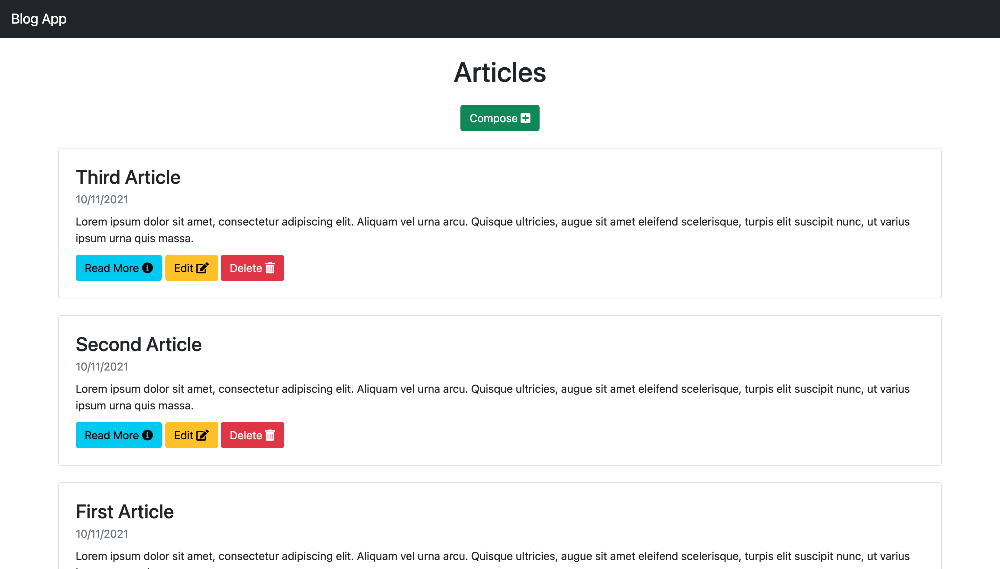
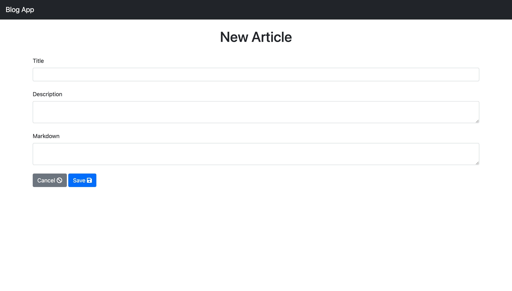

# Blog App
An application used to create, edit, and delete articles.
* Heroku Deploy: [https://blog-app-08992.herokuapp.com/](https://blog-app-08992.herokuapp.com/)

### Preview:

### Technologies:
* Programming Languages:
  * HTML
  * EJS
  * CSS
  * Javascript
* Tech Stack:
  * MongoDB Atlas
  * Express JS
  * Node JS
* Others:
  * Bootstrap (CSS Framework)
  * Font Awesome (Icons)